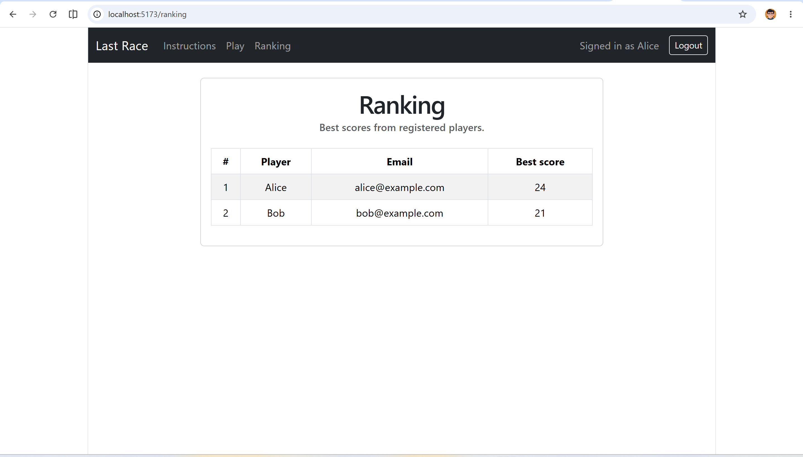
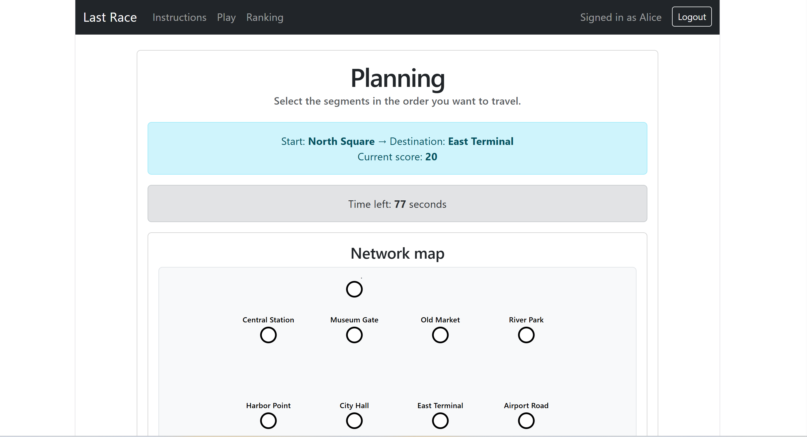

# Exam #1: "Last Race"

## Student: s330058 Yasin Rohani

## Project Description

Last Race is a full-stack single-player route planning game based on a fictional underground network.

A registered user logs in, starts a new game, receives a random starting station and a random destination station, studies the complete network during the setup phase, and then selects route segments in the planning phase.

After the route is submitted, the backend validates the route, executes the game logic, calculates the final score, stores the result in the database, and the frontend displays the result. A ranking page shows the best scores of registered users.

The project is implemented with:

- React and JavaScript for the frontend
- Node.js and Express for the backend
- SQLite for persistent storage
- Session-based authentication with Passport

---

## React Client Application Routes

- Route `/`
  - Displays the instructions page.
  - Explains the game goal, the game phases, and the main rules.

- Route `/login`
  - Displays the login form.
  - Allows a registered user to authenticate with username and password.

- Route `/setup`
  - Protected route.
  - Displays the setup page.
  - Shows the complete underground network before starting the game.
  - Includes the full network map, stations, lines, and available connections.
  - Allows the user to start a new game.

- Route `/planning/:gameId`
  - Protected route.
  - Displays the planning page for a specific game.
  - `gameId` is the identifier of the game stored in the database.
  - Shows the assigned starting station, destination station, current score, and the available route segments.
  - Allows the user to select route segments in the order they want to travel.
  - Submits the selected route to the backend.

- Route `/result/:gameId`
  - Protected route.
  - Displays the result page for a specific game.
  - `gameId` is the identifier of the completed or invalid game.
  - Shows the final status, final score, starting station, destination station, and minimum distance.

- Route `/ranking`
  - Protected route.
  - Displays the ranking page.
  - Shows the best score of each registered user.

---

## API Server

### Authentication APIs

- POST `/api/sessions`
  - Request body:
    ```json
    {
      "username": "alice@example.com",
      "password": "Password123!"
    }
    ```
  - Authenticates a registered user.
  - Creates a server-side session.
  - Response body:
    ```json
    {
      "id": 1,
      "username": "alice@example.com",
      "name": "Alice"
    }
    ```

- GET `/api/sessions/current`
  - Returns the currently authenticated user.
  - Requires a valid session.
  - Response body:
    ```json
    {
      "id": 1,
      "username": "alice@example.com",
      "name": "Alice"
    }
    ```

- DELETE `/api/sessions/current`
  - Logs out the current user.
  - Destroys the session.

---

### Network APIs

- GET `/api/network/full`
  - Protected route.
  - Returns the complete underground network.
  - Used in the setup phase.
  - Response body includes:
    - stations
    - lines
    - lineStations
    - segments
    - segmentLines

- GET `/api/network/planning`
  - Protected route.
  - Returns the planning network data.
  - Used in the planning phase.
  - Response body includes the available segments that the user can select.

---

### Game APIs

- POST `/api/games`
  - Protected route.
  - Creates a new game for the logged-in user.
  - Randomly selects a starting station and a destination station.
  - Stores the game in the database with status `planning`, initial score `20`, and the computed minimum distance.
  - Response body example:
    ```json
    {
      "id": 29,
      "userId": 1,
      "startStationId": 4,
      "startStationName": "River Park",
      "destinationStationId": 11,
      "destinationStationName": "Harbor Point",
      "status": "planning",
      "score": 20,
      "createdAt": "2026-06-06 13:29:46",
      "minimumDistance": 4
    }
    ```

- GET `/api/games/:gameId`
  - Protected route.
  - Returns the game identified by `gameId`, only if it belongs to the logged-in user.
  - Used by the planning page and the result page.
  - Response body includes:
    - game id
    - user id
    - start station
    - destination station
    - status
    - score
    - creation date
    - minimum distance

- POST `/api/games/:gameId/route`
  - Protected route.
  - Submits the selected route for a specific game.
  - `gameId` is the identifier of the game.
  - Request body:
    ```json
    {
      "selectedSegmentIds": [3, 8, 11, 10]
    }
    ```
  - The backend validates the route.
  - It checks that:
    - the route starts from the assigned starting station
    - the selected segments are connected in sequence
    - each segment is selected only once
    - the route reaches the assigned destination
  - If the route is valid, the game is completed and the final score is calculated.
  - If the route is invalid, the game becomes invalid and the score is set to 0.
  - Response body includes the updated game result.

---

### Ranking API

- GET `/api/ranking`
  - Protected route.
  - Returns the best score of each registered user.
  - Response body example:
    ```json
    [
      {
        "userId": 1,
        "name": "Alice",
        "username": "alice@example.com",
        "bestScore": 24
      },
      {
        "userId": 2,
        "name": "Bob",
        "username": "bob@example.com",
        "bestScore": 21
      }
    ]
    ```

---

## Database Tables

- Table `users`
  - Stores registered users.
  - Contains user id, username, name, salt, and password hash.
  - Used for authentication.

- Table `stations`
  - Stores the underground stations.
  - Contains station id, station name, and coordinates used to draw the network map.

- Table `lines`
  - Stores the underground lines.
  - Contains line id, line name, and line color.

- Table `line_stations`
  - Stores the relationship between lines and stations.
  - Defines which stations belong to each line and their order on the line.

- Table `segments`
  - Stores the physical connections between pairs of stations.
  - Each segment connects two stations.

- Table `segment_lines`
  - Stores the relationship between segments and lines.
  - Defines which underground line each segment belongs to.

- Table `games`
  - Stores the games created by registered users.
  - Contains:
    - game id
    - user id
    - start station id
    - destination station id
    - status
    - score
    - creation date
    - minimum distance

- Table `game_steps`
  - Stores the execution steps of a completed game.
  - Contains the selected segment order, the travelled stations, the random event applied to each segment, the score variation, and the coins after each step.

- Table `events`
  - Stores the possible game events.
  - Events are used by the backend during game execution to affect the final score.

- Table `sessions`
  - Stores server-side session data.
  - Managed by `connect-sqlite3`.

---

## Main React Components

- `App` in `client/src/App.jsx`
  - Defines the main React application structure.
  - Configures React Router routes.
  - Wraps protected pages with `ProtectedRoute`.

- `NavigationBar` in `client/src/components/NavigationBar.jsx`
  - Displays the main navigation menu.
  - Shows links to Instructions, Play, and Ranking.
  - Shows the logged-in user and the logout button.

- `ProtectedRoute` in `client/src/components/ProtectedRoute.jsx`
  - Protects routes that require authentication.
  - Redirects unauthenticated users to the login page.

- `NetworkMap` in `client/src/components/NetworkMap.jsx`
  - Displays the underground network as an SVG map.
  - Draws stations as circles and segments as colored lines.
  - Used in the setup page.

- `InstructionsPage` in `client/src/pages/InstructionsPage.jsx`
  - Displays the game description, phases, and rules.

- `LoginPage` in `client/src/pages/LoginPage.jsx`
  - Displays the login form.
  - Calls the login API and updates the authentication context.

- `SetupPage` in `client/src/pages/SetupPage.jsx`
  - Loads and displays the complete network.
  - Allows the user to start a new game.

- `PlanningPage` in `client/src/pages/PlanningPage.jsx`
  - Loads the current game and the planning network.
  - Allows the user to select segments in order.
  - Submits the selected route to the backend.

- `ResultPage` in `client/src/pages/ResultPage.jsx`
  - Loads and displays the final result of a game.
  - Shows status, final score, start station, destination station, and minimum distance.

- `RankingPage` in `client/src/pages/RankingPage.jsx`
  - Loads and displays the ranking of registered users.

- `AuthContext` in `client/src/context/AuthContext.jsx`
  - Stores the current authenticated user.
  - Provides login, logout, and session refresh functionality.

- `API` module in `client/src/api/API.js`
  - Centralizes all frontend HTTP requests to the backend.
  - Uses `fetch` with `credentials: "include"` for session-based authenticated requests.

---

## Screenshot

### General ranking page



### Planning phase during a game



## Users Credentials

- Alice
  - username: `alice@example.com`
  - password: `Password123!`

- Bob
  - username: `bob@example.com`
  - password: `Password123!`

- Charlie
  - username: `charlie@example.com`
  - password: `Password123!`
---

## Use of AI Tools

I used ChatGPT as a learning and debugging assistant during the development of this project.

The AI tool was used to:
- clarify web application concepts
- review and explain code
- debug backend and frontend errors
- reason about API calls and route validation
- improve the structure of React components
- prepare for the oral discussion

All generated suggestions were manually reviewed, adapted, tested, and committed by me. I verified the implementation by running the application locally, testing the complete flow from login to game result, checking the ranking page, running the frontend production build, and confirming that the Git working tree was clean before submission.